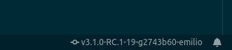

# script-result-info

This Visual Studio Code extension will execute a command in the shell and show the result in the status bar.

## How to use

Once installed, open your command actions (CTRL + SHIFT + P) and run `Script Result Info: Run command`. If the result is
good, you will see the status bar item with the info. Otherwise an error message will be shown.

Clicking on the status bar item for this extension will re run the command.

## Features

Currently the extension runs the following git command from the workspace root path

```
git describe --dirty="-$USER"
```

The result looks as follows


[](https://app.fossa.io/projects/git%2Bgithub.com%2Femilioidk%2Fscript-result-info?ref=badge_shield)

Clicking on the status bar item will re run the command.

Future releases will include flexibility for changing the command as well as many other options. Check the [changelog](CHANGELOG.md) for more information.

## Requirements

You must be able to execute the command (mostly, you must have the right permissions).

## Extension Settings

Coming soon

## Known Issues

None yet. If you run into an issue, would like to contribute, or would like to request a feature, please do so in this extension's GitHub repository.

## Release Notes

Checkout the [cangelog](CHANGELOG.md) for more details.

### 1.0.0

Initial release. User can only run custom command `git describe --dirty="-$USER"` and no configurations are yet permitted.

### 1.0.1

Added an important quality: run the command when the extension is activated.


## License
[](https://app.fossa.io/projects/git%2Bgithub.com%2Femilioidk%2Fscript-result-info?ref=badge_large)